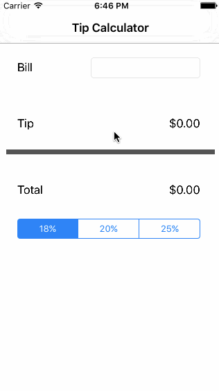

# Pre-work - *tipcalculator*

**tipcalculator** is a tip calculator application for iOS.

Submitted by: **Sophia Kecir Camper**

Time spent: **2:30** hours spent in total

## User Stories

The following **required** functionality is complete:
* [X] User can enter a bill amount, choose a tip percentage, and see the tip and total values. [Time spent: 1:30]

The following **optional** features are implemented:
* [ ] Custom font
* [ ] UI animations
* [X] Making sure the keyboard is always visible and the bill amount is always the first responder. This way the user doesn't have to tap anywhere to use this app. Just launch the app and start typing. [Time spent: 1:00, sources: http://stackoverflow.com/questions/259819/how-do-i-show-the-keyboard-by-default-in-uitextview, http://stackoverflow.com/questions/4130695/setting-a-uitextfield-into-editing-mode-programatically]

The following **additional** features are implemented:

- [ ] List anything else that you can get done to improve the app functionality!

## Video Walkthrough

Here's a walkthrough of implemented user stories:

GIF created with [LiceCap](http://www.cockos.com/licecap/).

## Notes

Describe any challenges encountered while building the app.

To add default cursor and visible keyboard to billField:
1. Add the following before "override func viewDidLoad()" :
    override func viewDidAppear(animated: Bool) {
        // Show keyboard by default
        billField.becomeFirstResponder()
    }
2. "Toggle Software Keyboard" again

## License

    Copyright [2016] [Sophiakc.com]

    Licensed under the Apache License, Version 2.0 (the "License");
    you may not use this file except in compliance with the License.
    You may obtain a copy of the License at

        http://www.apache.org/licenses/LICENSE-2.0

    Unless required by applicable law or agreed to in writing, software
    distributed under the License is distributed on an "AS IS" BASIS,
    WITHOUT WARRANTIES OR CONDITIONS OF ANY KIND, either express or implied.
    See the License for the specific language governing permissions and
    limitations under the License.
