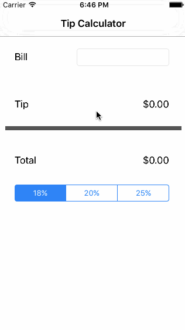
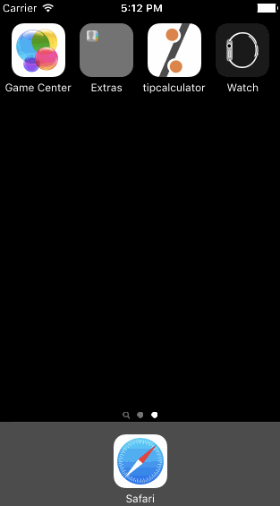

# Pre-work - *tipcalculator*

**tipcalculator** is a tip calculator application for iOS using Swift.

Submitted by: [**Sophia Kecir Camper**](http://www.sophiakc.com)

Total time spent: **3:30** cumulated hours

## User Stories

The following **required** functionality is complete:
* [X] User can enter a bill amount, choose a tip percentage, and see the tip and total values. [Time spent: 1:30]

The following **optional** features are implemented:
* [X] Custom font [Time spent: 0:30]
* [X] Making sure the keyboard is always visible and the bill amount is always the first responder. This way the user doesn't have to tap anywhere to use this app. Just launch the app and start typing. [Time spent: 1:00]
* [ ] UI animation: show only the billField and keyboard when launching the app, then when starting typing, sliding up the other elements

The following **additional** features are implemented:
List anything else that you can get done to improve the app functionality!
* [X] Logo on app icone [Time spent: 0:30]
* [ ] Add currency in front of billField
* [ ] Limit the length of inputs in the billField and possibly get font size smaller when large amount

## Video Walkthrough

Here's a walkthrough of implemented user stories:

v1: required functionality

v2: optional / additional functionalities

GIF created with [LiceCap](http://www.cockos.com/licecap/).

## Notes, challenges encountered while building the app:
Red: in progress, didn't find yet | Orange: find a solution, maybe not the best one | Green: find the solution

- Custom font [Orange]: I was looking at changing the default font for the entire app (SystemFont) but ended up at changing each individual elements instead.

- Making the keyboard always visible and the bill amount the first responder [Green]: eventually found out how to do it thanks to: http://stackoverflow.com/questions/259819/how-do-i-show-the-keyboard-by-default-in-uitextview, http://stackoverflow.com/questions/4130695/setting-a-uitextfield-into-editing-mode-programatically
To add default cursor and visible keyboard to billField:
1. Add the following before "override func viewDidLoad()" :
    override func viewDidAppear(animated: Bool) {
        // Show keyboard by default
        billField.becomeFirstResponder()
    }
2. "Toggle Software Keyboard" again

- Logo on app icone [Green] (sources: http://stackoverflow.com/questions/28170520/ios-how-to-set-app-icon-and-launch-images)

- Add currency in front of billField [Red]: spent more than an hour on research and experiment but didn't find out (yet)

- Limit the length of inputs in the billField and possibly get font size smaller when large amount [Red]

## License

    Copyright [2016] [Sophiakc.com](http://www.sophiakc.com)

    Licensed under the Apache License, Version 2.0 (the "License");
    you may not use this file except in compliance with the License.
    You may obtain a copy of the License at

        http://www.apache.org/licenses/LICENSE-2.0

    Unless required by applicable law or agreed to in writing, software
    distributed under the License is distributed on an "AS IS" BASIS,
    WITHOUT WARRANTIES OR CONDITIONS OF ANY KIND, either express or implied.
    See the License for the specific language governing permissions and
    limitations under the License.
